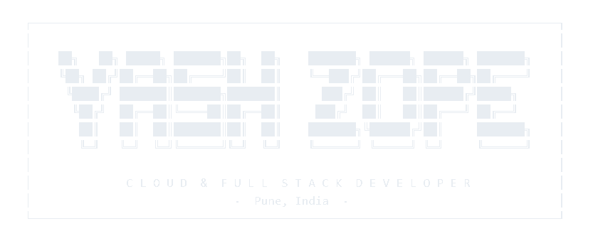

<!-- ═══════════════════════════════════════════════════════════════════ -->
<!--                  YASH ZOPE  ·  GITHUB PROFILE README               -->
<!--          Crafted in the tradition of the engineering notebook       -->
<!-- ═══════════════════════════════════════════════════════════════════ -->

<div align="center">
  
<picture>
  <source media="(prefers-color-scheme: dark)" srcset="./assets/logo-dark-transparent.svg">
  <source media="(prefers-color-scheme: light)" srcset="./assets/logo-light-transparent.svg">
  
</picture>

<br><br>

<i>"Every great system was first a sketch on the back of an envelope."</i>

</div>
*"Every great system was first a sketch on the back of an envelope."*

[](https://main.d226cvc30nip9r.amplifyapp.com/)
[](https://www.linkedin.com/in/yash-zope-50a2523a6/)
[](mailto:zopeyash66w@gmail.com)

</div>

---

## ❧  Field Notes  ·  About This Engineer

```
┌──────────────────────────────────────────────────────────────┐
│  SUBJECT     :  Yash Zope                                    │
│  DISCIPLINE  :  Cloud & Full Stack Development               │
│  BASE CAMP   :  Pune, Maharashtra, India                     │
│  STACK RANGE :  React → Node → AWS  ·  End-to-end            │
│  PHILOSOPHY  :  Ship clean. Document well. Iterate always.   │
└──────────────────────────────────────────────────────────────┘
```

My work focuses on **full-stack web applications**, **cloud deployment**,
and **building scalable systems**. Currently exploring DevOps practices,
CI/CD pipelines, and cloud-native architectures — always iterating,
always improving the craft.

---

## 📌  Current Expedition  ·  Active Pursuits

```
    ┌───────────────────────────────────────────────────────┐
     │                                                     │
    │   ✦  Building Full Stack Applications                 │
   │    ✦  Exploring AWS Cloud Architecture                  │
   │    ✦  Learning DevOps & CI/CD Pipelines                 │
    │   ✦  Improving System Design Skills                   │
     │                                                     │
    └───────────────────────────────────────────────────────┘
```

---

## ⚙️  Workshop Inventory  ·  Arsenal

<div align="center">

### ◈  Frontend


### ◈  Backend


### ◈  Database


### ◈  Cloud · AWS


### ◈  DevOps & Tools


### ◈  Concepts


</div>

---

## 🌱  Currently Learning

```
  ┌───────────────────────────────────────────────────────┐
  │                                                       │
  │      Kubernetes  ·  Container Orchestration           │
  │      Advanced AWS Services                            │
  │      DevOps Practices & Infrastructure Automation     │
  │                                                       │
  └───────────────────────────────────────────────────────┘
```

---

## 📐  Project Blueprints  ·  Flagship Works

> *Three real problems. Three production-grade solutions. All shipped.*

---

### ▸  Smart Attendance System  ·  Biometric & Cloud
`HTML5 · JavaScript · face-api.js · AWS Cognito · Firebase · QR`  &nbsp;·&nbsp;  Full Stack · Deployed

A production-grade biometric attendance platform for educational institutions.
On-device face recognition via TensorFlow.js/face-api.js — no server-side image processing.
Students authenticate through a dual-factor system: a class **QR code + a rotating 4-digit
security code** that refreshes every 8 seconds to eliminate proxy attendance.

Role-based dashboards for Admins, Teachers, and Students. Firebase Realtime Database for
live sync with IndexedDB offline fallback. Full Cognito ↔ Firebase custom token exchange
handles the auth chain end-to-end.

```
  Stack  :  face-api.js · jsQR · AWS Cognito · Firebase RTDB · Bootstrap 5
  Auth   :  Cognito JWT → Custom Firebase Token → signInWithCustomToken()
  Roles  :  Admin · Teacher · Student  (RBAC enforced at DB rules level)
  Data   :  Firebase live sync  +  IndexedDB offline fallback
```

[](https://main.d37taywsxgqmhw.amplifyapp.com)
[](https://github.com/YASH-ZOPE/Attendance)

---

### ▸  Timetable Management System  ·  Role-Based Scheduling
`React.js · AWS Cognito · Firebase RTDB · React Router v6 · html2canvas`  &nbsp;·&nbsp;  Full Stack

A premium multi-role timetable coordination platform for educational institutions.
Admin panel with full CRUD over departments, subjects, and schedule grids — including
**keyboard arrow-key navigation** for slot editing. Teacher portal for course registration
and live schedule views. Public search portal with **one-click PNG export** for students.

Live messaging inbox between teachers and administration built in. Cognito groups
(`admin` / `teacher`) drive role-based route guards via a `ProtectedRoute` component.

```
  Stack  :  React 18 · React Router v6 · AWS Cognito · Firebase RTDB v10
  Auth   :  Cognito User Pool Groups → ID token parsing → role-based redirect
  Export :  html2canvas + file-saver → high-quality PNG schedule download
  Roles  :  Admin · Teacher · Public Guest  (protected route guards)
```

[](https://github.com/YASH-ZOPE/teacher-timetable-generator)

---

### ▸  Engineering Notebook Portfolio  ·  Personal Brand
`HTML · CSS · JavaScript · AWS Amplify`  &nbsp;·&nbsp;  Frontend · Deployed

A handcrafted portfolio styled as a vintage leather-bound engineering notebook.
Features cinematic page-turn transitions, blueprint zoom, multi-tab navigation
(Skills · Projects · Journey · About · Contact), polaroid photo frames, and
botanical sketch details. The design itself is the statement.

```
  Theme  :  Skeuomorphic · Vintage · Parchment textures · Leather binding
  UX     :  Animated tab transitions · Blueprint zoom · Cinematic intro
  Host   :  AWS Amplify  ·  Custom domain pipeline
```

[](https://main.d226cvc30nip9r.amplifyapp.com/)
[](https://github.com/YASH-ZOPE)

---

## 🐍  Contribution Trail

<div align="center">


</div>

---

## 📊  Activity Logs  ·  GitHub Statistics

<div align="center">

<a href="https://github.com/YASH-ZOPE">
<!--  
 -->
</a>

<br/><br/>

<a href="https://git.io/streak-stats">
  
</a>

</div>

---

## ✉  Correspondence  ·  Connect

<div align="center">

*The notebook is open. The drafting table is lit.*

[](https://www.linkedin.com/in/yash-zope-50a2523a6/)
[](https://main.d226cvc30nip9r.amplifyapp.com/)
[](mailto:zopeyash66w@gmail.com)
</div>

---

<div align="center">

```
  · · ·  Filed & sealed in the tradition of the engineering notebook  · · ·
                     YASH ZOPE  ·  Pune, India  ·  2025 – present
```

</div>
